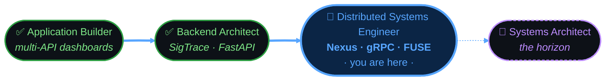

<!-- Header -->
<p align="center">
  
</p>

<p align="center">
  <a href="https://www.linkedin.com/in/frank-bwalya-64b124275">
    
  </a>
  <a href="mailto:bwalyafrank61@gmail.com">
    
  </a>
  
</p>

---

## ◈ The Mindset

> Most developers build features. I'm learning to design **systems**.

I'm a software engineering student at the stage where the interesting questions shift — from *"how do I make this work?"* to *"how do I make this hold?"* My focus is on **backend architecture**, **distributed application design**, and **blockchain infrastructure**. I'm not chasing breadth. I'm deliberately deepening.

My current trajectory: grow from a developer who builds applications into an engineer who designs the **structures** those applications run on.

```
surface-level dev  →  application builder  →  [current]  →  system architect
```

---

## ◈ What I'm Actually Working On

### `01` — Nexus — Personal Device Mesh *(Active)*
> *Your devices, one filesystem — nothing copied until it's read*

A **personal device mesh** built from scratch in **Rust**: mount your phone's storage on your laptop as a real, lazy-loaded FUSE filesystem. `ls`, `cat`, `cp` all behave like a local directory — but nothing transfers until you actually read it.

- **Lazy FUSE virtualization** — remote files appear local; bytes move on demand, not on mount
- **Typed gRPC transport** — a `FileService` contract (ListDir / Stat / ReadFile) over Tonic + Prost
- **Cross-compiled to Android** — `cargo-ndk`, arm64-v8a; the host role runs on-device
- **Hardware-verified** — byte-exact reads across a real phone → laptop mount, including chunk-boundary offset reads

Stack: `Rust` · `Tokio` · `gRPC` · `Protobuf` · `FUSE`  
Focus: Systems programming where correctness is measured in bytes.  
[→ View Repository](https://github.com/b5119/nexus02)

---

### `02` — CDF SigTrace — Blockchain Accountability Framework *(In Progress)*
> *Making public money provable, not just trackable*

A **blockchain-anchored accountability framework** for Zambia's Constituency Development Fund and government procurement — two systems, **SigTrace** (procurement contract integrity) and **CDF Pulse** (field-delivery verification), joined by a monitor that flags ghost projects.

- **Dual-ledger anchoring** — Hyperledger Fabric for institutional membership, Polygon for citizen-verifiable confirmations
- **Privacy by architecture** — personal data stays off-chain; only hashes and non-personal metadata are written
- **Risk signals, not verdicts** — every analytical output is a flag requiring human review, never a determination of wrongdoing
- **Offline-first field app** — CDF Pulse PWA for delivery verification where connectivity isn't guaranteed

Stack: `Python` · `FastAPI` · `PostgreSQL` · `Solidity` · `Hyperledger Fabric` · `Polygon` · `React`  
Focus: Civic-tech transparency under real infrastructure constraints.  
[→ View Repository](https://github.com/b5119/cdf-sigtrace-zambia)

---

## ◈ Technical Stack

<p align="center">
  <br/>
  <br/>
  
</p>

<br/>

### Core Languages

<div align="center">


</div>

### Systems & Backend

<div align="center">


</div>

### Blockchain & Frontend

<div align="center">


</div>

### Infrastructure & Tooling

<div align="center">


-FCC624?style=for-the-badge&logo=linux&logoColor=black)


</div>

### Learning / Integrating in 2026

<div align="center">


</div>

---

## ◈ The Architecture

```python
class FrankBwalya:
    """
    Software Engineering Student → System Architect in Training
    Lusaka, Zambia | 2026
    """

    trajectory = [
        "application-level development",     # ✅ done
        "backend architecture & patterns",   # ✅ done
        "distributed systems design",        # ← currently here
        "smart contract ecosystems",         # ⬜ in progress
        "full system architecture",          # 🎯 destination
    ]

    engineering_focus = {
        "systems":     ["Rust", "Tokio", "gRPC", "FUSE", "cross-compilation"],
        "backend":     ["FastAPI", "Flask", "service-layer design", "API orchestration"],
        "blockchain":  ["Solidity", "Hyperledger Fabric", "Polygon", "on-chain anchoring"],
        "mobile":      ["Flutter", "Dart", "Android (cargo-ndk)", "offline-first PWAs"],
        "devops":      ["Docker", "CI/CD", "environment-based configuration"],
    }

    principle = (
        "I am intentionally refining previous systems rather than chasing new ones. "
        "Architectural depth over surface-level expansion."
    )

    def current_question(self) -> str:
        return "Not 'how do I build this?' — but 'how should this be designed?'"
```

---

## ◈ GitHub Statistics

<p align="center">
  
  &nbsp;
  
</p>

<p align="center">
  
</p>

<p align="center">
  
</p>

---

## ◈ Trophy Case

<p align="center">
  
</p>

---

## ◈ 2026 Engineering Growth & Collaboration

### Technical Growth Areas

I am actively deepening expertise in:

- **Distributed systems principles** — consistency models, fault tolerance, replication strategies
- **Scalable backend design** — service boundaries, load patterns, API contract discipline
- **Smart contract security** — audit patterns, invariant testing, formal verification concepts
- **Containerization & deployment** — Docker, CI/CD pipeline design, environment management
- **Test-driven backend development** — integration testing, contract testing, coverage discipline
- **Data modeling for decision systems** — schema design that reflects domain logic, not just storage

The objective is not tool accumulation. It is **architectural fluency**.

### Collaboration & Internship Intent

I am actively seeking:

- **Backend engineering internships** — production exposure across real system constraints
- **Distributed systems research collaboration** — theory applied to implementation
- **Blockchain infrastructure projects** — smart contract ecosystems with genuine use cases
- **Open-source backend contributions** — meaningful PRs, not surface-level fixes

If you are building structured, scalable systems — I am interested in contributing seriously, not superficially.

📧 **bwalyafrank61@gmail.com** · 💼 [LinkedIn](https://www.linkedin.com/in/frank-bwalya-64b124275)

### Research Direction

My long-term interest areas converge around systems that operate under real-world constraints:

- **Trust modeling in decentralized environments** — what replaces institutional guarantees at the protocol level
- **System reliability under constrained infrastructure** — designing for contexts where resources and margin are limited
- **Backend architecture for emerging markets** — systems built for conditions, not assumptions
- **Data-informed decision systems** — where analytical modeling drives outcomes, not just dashboards

I am particularly interested in bridging **formal system design principles** with **production-level implementation** — closing the gap between theory and what actually ships.

### Forward Vision — The Roadmap

<p align="center">
  
</p>



<div align="center">

| Phase | Status | Driving work | Progress |
|:--|:--:|:--|:--|
| **Application Builder** | ✅ Done | Multi-API Flask dashboards |  |
| **Backend Architect** | ✅ Done | SigTrace · FastAPI service layer |  |
| **Distributed Systems Engineer** | 🔵 In progress | **Nexus** · gRPC · FUSE · device mesh |  |
| **Systems Architect** | 🎯 Horizon | Designing the structures themselves |  |

</div>

Not just code that runs. **Systems that endure.**

---

## ◈ Let's Connect

📧 **Email:** bwalyafrank61@gmail.com  
💼 **LinkedIn:** [Frank Bwalya](https://www.linkedin.com/in/frank-bwalya-64b124275)

---

## ◈ The Quote I Keep Coming Back To

> *"Knowledge is a paradox. The more we understand, the more we realize the vastness of our ignorance."*
>
> **— Viktor, Arcane**

That isn't discouragement. It's the only honest description of what engineering actually is — a permanent state of knowing enough to understand how much remains. The engineers worth learning from aren't the ones who know the most. They're the ones who've stayed long enough to understand *how much they don't know* — and kept building anyway.

---

<p align="center">
  
</p>

<p align="center">
  
  &nbsp;
  
</p>

<p align="center">
  <sub>Last updated: 2026 · Lusaka, Zambia · Built with deliberate intent, not just enthusiasm ☕</sub>
</p>
