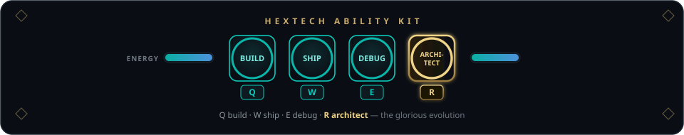

<!-- Header -->
<p align="center">
  
</p>

<p align="center">
  <a href="https://www.linkedin.com/in/frank-bwalya-64b124275">
    
  </a>
  <a href="mailto:bwalyafrank61@gmail.com">
    
  </a>
  
</p>

---

## ◈ Mindset

> Most developers build features. I'm learning to design **systems**.

I'm a software engineering student at the stage where the interesting questions shift — from *"how do I make this work?"* to *"how do I make this hold?"* My focus is on **backend architecture**, **distributed application design**, and **blockchain infrastructure**. I'm not chasing breadth. I'm deliberately deepening.

My current trajectory: grow from a developer who builds applications into an engineer who designs the **structures** those applications run on.

```
surface-level dev  →  application builder  →  [current]  →  system architect
```

---

## ◈ At a Glance

| | |
|:--|:--|
| 🏆 **Award** | 1st place, 2026 ZAMREN Student Hackathon (ZedLedger) |
| 🔧 **Shipped** | 100+ merged pull requests across 11 repositories; Flutter internship shipping offline-first features to production |
| 🦀 **Core stack** | Rust · Go · Python · TypeScript · Dart · Solidity |
| 🎓 **Studying** | BSc Software Engineering, ZCAS University (final year) |
| 🔎 **Open to** | Backend / distributed-systems internships and open-source collaboration |

---

## ◈ What I'm Actually Working On

#### `01` — Nexus — Personal Device Mesh *(Active · file mesh and screen streaming working; Android file access designed)*
> *Paired devices, one authenticated mesh — filesystem, streaming, migration*

A **personal device mesh** built from scratch in **Rust**: mount any paired
device's storage as a real FUSE filesystem, stream its screen over an
authenticated gRPC channel, and migrate app state between devices — all over
an mTLS-encrypted, code-paired connection.

- **Lazy FUSE virtualization** — remote files appear local; bytes move on
  demand, not on mount. Multi-writer conflict detection via vector clocks —
  concurrent edits keep both versions, never silently lose data.
- **Device pairing** — 6-digit code exchange, per-device identity certificates,
  mTLS on every connection. Proven on a real Android phone → Linux laptop mount,
  byte-exact including chunk-boundary offset reads.
- **Screen streaming** — H.264 encode (QSV/libx264 fallback) → gRPC
  bidirectional stream → decode + winit display, with raw uinput input injection.
- **Migration SDK** — app-cooperative state migration with three conflict
  policies (LastWriteWins / AppMerge / KeepBoth), Android JNI bindings via
  the `jni` crate.
- **Engineering discipline** — 100+ tests, CI-gated on every PR (build + test +
  fmt + clippy), branch-protected main, 17 ADRs documenting every real
  constraint hit along the way.

Stack: `Rust` · `Tokio` · `gRPC/tonic` · `FUSE` · `ffmpeg` · `PipeWire` ·
`TLS/mTLS` · `Android (cargo-ndk)`
[→ View Repository](https://github.com/b5119/nexus)  
Related: an ext4 partition-recovery case study (read-only diagnosis, device-mapper stitching, zero data lost).

---

### `02` — CDF SigTrace — Blockchain Accountability Framework *(Final-year project · prototype complete)*
> *Making public money provable, not just trackable*

A **blockchain-anchored accountability framework** for Zambia's Constituency Development Fund and government procurement — two systems, **SigTrace** (procurement contract integrity) and **CDF Pulse** (field-delivery verification), joined by a monitor that flags ghost projects.

- **Dual-ledger anchoring** — Hyperledger Fabric for institutional membership, Polygon for citizen-verifiable confirmations *(both simulated in the prototype; no live institutional data yet)*
- **Privacy by architecture** — personal data stays off-chain; only hashes and non-personal metadata are written
- **Risk signals, not verdicts** — every analytical output is a flag requiring human review, never a determination of wrongdoing
- **Offline-first field app** — CDF Pulse PWA for delivery verification where connectivity isn't guaranteed

Stack: `Python` · `FastAPI` · `PostgreSQL` · `Solidity` · `Hyperledger Fabric` · `Polygon` · `React`  
Focus: Civic-tech transparency under real infrastructure constraints.  
🌐 [Live demo (demonstration data)](https://frontend-public-app.vercel.app) · 🔒 Source private — walkthrough available on request

---

## ◈ Team & Client Work

| Project | Role | What I shipped |
|:--|:--|:--|
| **BantuSave** — digitised Chilimba savings platform | Backend contributor, five-person team | 280+ commits and 54 merged PRs in a Go codebase (~45k lines): payout/disbursement engine, KYC decision and recheck-before-payout, reconciliation thresholds and exception workflow |
| **Kwacha Yield** — Zambian T-Bill and Bond investor companion *(Vector Zero)* | Frontend lead | Expo / React Native app: PIN and security, securities, yield calculator, portfolio, alerts; 9 merged PRs, CI on every PR |
| **ViewLock** — Android screen-privacy app *(Vector Zero)* | Android developer | Kotlin / Compose: screenshot detection, service lifecycle and privacy fixes, unified design system |

🔒 Private repositories — walkthroughs available on request.

---

## ◈ Technical Stack

<div align="center">

| | |
|:--|:--|
| **Languages**<br/><sub>what I ship in</sub> | <br/> |
| **Backend & APIs**<br/><sub>services and contracts</sub> | <br/>    |
| **Systems**<br/><sub>low-level and distributed</sub> |       |
| **Blockchain**<br/><sub>contracts and anchoring</sub> | <br/>   |
| **Frontend & Mobile**<br/><sub>web and cross-platform</sub> |  |
| **Data**<br/><sub>storage</sub> |  |
| **Infra & Tooling**<br/><sub>delivery and workflow</sub> |  |
| **Integrating in 2026**<br/><sub>actively learning</sub> |  |

</div>

---

## ◈ The Architecture

```python
class FrankBwalya:
    """
    Software Engineering Student → System Architect in Training
    Lusaka, Zambia | 2026
    """

    trajectory = [
        "application-level development",     # ✅ done
        "backend architecture & patterns",   # ✅ done
        "smart contract ecosystems",         # ✅ done — ChainBa (3 contracts, 23 tests)
        "distributed systems design",        # ← currently here
        "full system architecture",          # 🎯 destination
    ]

    engineering_focus = {
        "systems":     ["Rust", "Tokio", "gRPC", "FUSE", "cross-compilation"],
        "backend":     ["FastAPI", "Flask", "Laravel", "Go (chi)", "OpenAPI / Swagger", "service-layer design"],
        "blockchain":  ["Solidity", "Hardhat", "OpenZeppelin", "ethers.js", "dApp delivery"],
        "civic_tech":  ["digital identity (ZedLedger)", "gov accountability (SigTrace)", "data-protection compliance"],
        "mobile":      ["Flutter", "Dart", "Android (cargo-ndk)", "offline-first PWAs"],
        "devops":      ["Docker", "AWS deployment", "Tailscale + SSH", "CI/CD", "environment-based configuration"],
    }

    principle = (
        "I am intentionally refining previous systems rather than chasing new ones. "
        "Architectural depth over surface-level expansion."
    )

    def current_question(self) -> str:
        return "Not 'how do I build this?' — but 'how should this be designed?'"
```

---

## ◈ GitHub Statistics

<p align="center">
  
  &nbsp;
  
</p>

<p align="center">
  
</p>

<p align="center">
  
</p>

---

## ◈ More of My Work

### 🏆 ZedLedger — Zambia eNID Platform *(Hackathon Winner)*
> *1st place · Zambia Digital ID category · 2026 ZAMREN Student Hackathon, Livingstone*

<p align="center">
  
</p>

A full-stack **digital national identity platform** for Zambia, built by a team of four under hackathon conditions — citizen registration, eNID issuance, civil registration (births/deaths), and blockchain-anchored certificates.

- **Backend lead** — I owned the identity, mobile-money (GSB / ISO 8583), immigration, blockchain, and API-gateway services
- **Microservice architecture** — seven services behind a single JWT-validating API gateway, with isolated PostgreSQL schemas per domain
- **On-chain integrity** — Hyperledger Fabric anchors tamper-evident certificate hashes for births, deaths, and IDs
- **Compliance by design** — aligned with the Zambia Data Protection Act No. 3 of 2021

Stack: `Next.js` · `Python` · `FastAPI` · `Hyperledger Fabric` · `PostgreSQL` · `Docker`  
🔒 Private (hackathon repo) — walkthrough available on request

---

---

> Plus breadth across backend, blockchain, and mobile:

<p align="center">
  <a href="https://github.com/b5119/flask-api-dashboard">
    
  </a>
  <a href="https://github.com/b5119/chainba">
    
  </a>
</p>

<p align="center">
  <a href="https://github.com/b5119/gpa_tracker">
    
  </a>
  <a href="https://github.com/b5119/python-api-projects">
    
  </a>
</p>

---

## ◈ 2026 Engineering Growth & Collaboration

### Technical Growth Areas

I am actively deepening expertise in:

- **Distributed systems principles** — consistency models, fault tolerance, replication strategies
- **Scalable backend design** — service boundaries, load patterns, API contract discipline
- **Smart contract security** — audit patterns, invariant testing, formal verification concepts
- **Containerization & deployment** — Docker, CI/CD pipeline design, environment management
- **Test-driven backend development** — integration testing, contract testing, coverage discipline
- **Data modeling for decision systems** — schema design that reflects domain logic, not just storage

The objective is not tool accumulation. It is **architectural fluency**.

### Collaboration & Internship Intent

I am actively seeking:

- **Backend engineering internships** — production exposure across real system constraints
- **Distributed systems research collaboration** — theory applied to implementation
- **Blockchain infrastructure projects** — smart contract ecosystems with genuine use cases
- **Open-source backend contributions** — meaningful PRs, not surface-level fixes

If you are building structured, scalable systems — I am interested in contributing seriously, not superficially.

📧 **bwalyafrank61@gmail.com** · 💼 [LinkedIn](https://www.linkedin.com/in/frank-bwalya-64b124275)

### Research Direction

My long-term interest areas converge around systems that operate under real-world constraints:

- **Trust modeling in decentralized environments** — what replaces institutional guarantees at the protocol level
- **System reliability under constrained infrastructure** — designing for contexts where resources and margin are limited
- **Backend architecture for emerging markets** — systems built for conditions, not assumptions
- **Data-informed decision systems** — where analytical modeling drives outcomes, not just dashboards

I am particularly interested in bridging **formal system design principles** with **production-level implementation** — closing the gap between theory and what actually ships.

### Forward Vision — The Roadmap

<!-- Animated roadmap: a data packet travels the track through each milestone on a loop.
     Source: assets/roadmap.svg (hand-authored animated SVG) -->
<p align="center">
  
</p>

<div align="center">

| Phase | Status | Driving work | Progress |
|:--|:--:|:--|:--|
| **Application Builder** | ✅ Done | Multi-API Flask dashboards |  |
| **Backend Engineer** | ✅ Done | API Hub · Flask service-layer & blueprints |  |
| **Smart Contracts & dApps** | ✅ Done | **ChainBa** · Solidity · OpenZeppelin · 23 tests |  |
| **Distributed Systems Engineer** | 🔵 In progress | **Nexus** · gRPC · FUSE · device mesh · streaming · pairing |  |
| **Systems Architect** | 🎯 Horizon | Designing the structures themselves |  |

</div>

<p align="center">
  <b>Domains already shipped:</b><br/>
  
  
  
</p>

Not just code that runs. **Systems that endure.**

---

## ◈ Let's Connect

📧 **Email:** bwalyafrank61@gmail.com  
💼 **LinkedIn:** [Frank Bwalya](https://www.linkedin.com/in/frank-bwalya-64b124275)

---

## ◈ The Quote I Keep Coming Back To

> *"Knowledge is a paradox. The more we understand, the more we realize the vastness of our ignorance."*
>
> **— Viktor, Arcane**

That isn't discouragement. It's the only honest description of what engineering actually is — a permanent state of knowing enough to understand how much remains. The engineers worth learning from aren't the ones who know the most. They're the ones who've stayed long enough to understand *how much they don't know* — and kept building anyway.

<p align="center">
  
</p>

---

<p align="center">
  
  &nbsp;
  
</p>

<p align="center">
  <sub>Last updated: November 2026 · Lusaka, Zambia · Built with deliberate intent, not just enthusiasm ☕</sub>
</p>
